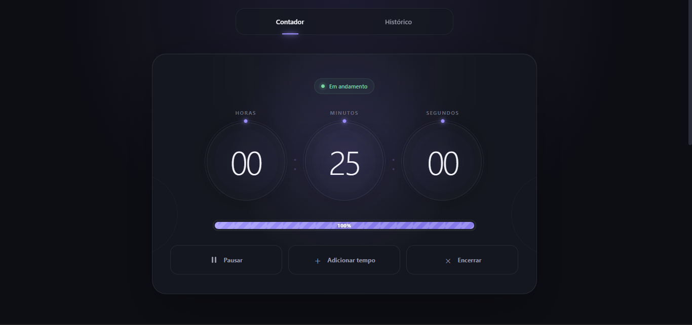

# ⏱️ Timer Dashboard

Um dashboard de cronômetro/timer simples e elegante, com tema escuro, contagem de horas/minutos/segundos, barra de progresso e histórico de sessões.



## ✨ Funcionalidades

- **Contador (Timer)**
  - Exibição de tempo em Horas, Minutos e Segundos
  - Indicador de status ("Em andamento")
  - Barra de progresso com percentual
  - Ações rápidas: **Iniciar**, **Pausar**, **Adicionar tempo** e **Encerrar**


- **Histórico**
  - Listagem das sessões anteriores em formato de tabela
  - Colunas: Início, Tempo total e Status
  - Contador total de sessões registradas
  - Status visual: `Concluído` / `Interrompido`

- Navegação por abas entre as seções **Contador** e **Histórico**


## 🚀 Como usar

1. Clone ou baixe este repositório.
2. Certifique-se de que a estrutura de pastas `css/` e `js/` está presente com os arquivos `style.css` e `script.js`.
3. Abra o arquivo `main.html` diretamente no navegador, ou use uma extensão como o **Live Server** (VS Code) para servir o projeto localmente.

```bash
# Exemplo usando Live Server
# Acesse em: http://127.0.0.1:5500/main.html
```

### Rodando com Django (backend)

O projeto também contará com um backend em **Python/Django**, responsável por persistir as sessões do histórico e servir os dados do timer.

1. Crie e ative um ambiente virtual:
   ```bash
   python -m venv venv
   source venv/bin/activate   # Linux/Mac
   venv\Scripts\activate      # Windows
   ```
2. Instale as dependências:
   ```bash
   pip install -r requirements.txt
   ```
3. Aplique as migrações do banco de dados:
   ```bash
   python manage.py migrate
   ```
4. Inicie o servidor de desenvolvimento:
   ```bash
   python manage.py runserver
   ```
5. Acesse em: `http://127.0.0.1:8000`

## 🛠️ Tecnologias

- **HTML5** — estrutura semântica da página
- **CSS3** — estilização (arquivo `css/style.css`)
- **Python** — linguagem do backend
- **Django** — framework web para regras de negócio, API e persistência dos dados (histórico de sessões)


## 📋 Seções do HTML

| Seção | ID | Descrição |
|-------|-----|-----------|
| Contador | `#contador` | Tela principal com o timer, progresso e ações |
| Histórico | `#historico` | Tabela com o registro das sessões anteriores |

